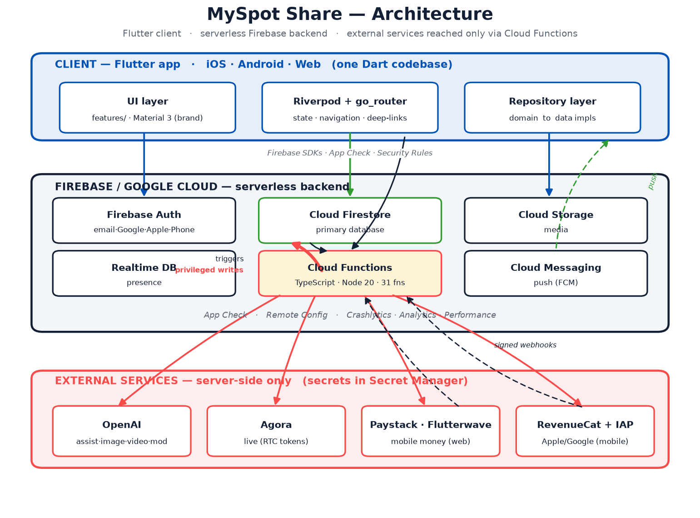
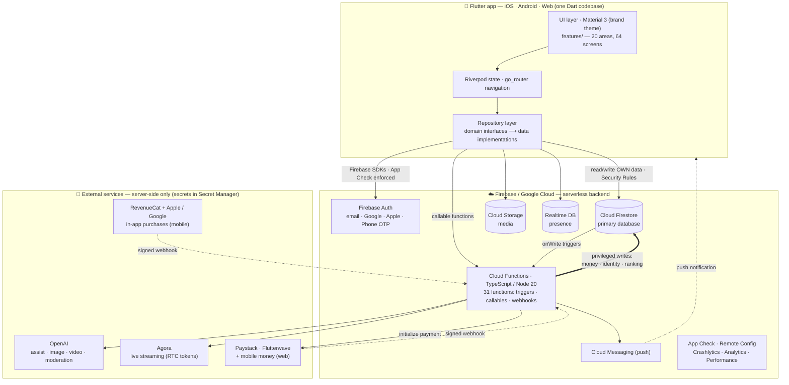

# MySpot Share — Architecture Diagram

One Dart codebase (Flutter) on the client; a serverless Firebase backend; external
services reached **only** from Cloud Functions. Clients read/write their own data
directly (guarded by Security Rules); money, identity, and ranking are written
**only** by Cloud Functions — that's the trust boundary.

> The Mermaid source below renders on GitHub and is the editable version of the
> diagram above.

**Reading the trust boundary**
- Thin solid arrows = the client acting as itself (constrained by `firestore.rules`
  + App Check). It can read feeds and write its own posts/messages, but **cannot**
  grant itself `verified`/`premium`/`role` or change counters/ranking.
- The thick arrow = Cloud Functions writing with admin privileges — the only path
  that sets money, identity, or ranking, triggered by Firestore writes or by
  signature-verified payment webhooks.
- Dotted arrows = asynchronous callbacks (webhooks in, push out).

See `docs/01`–`docs/18` for the per-area detail (data model, rules, functions
catalog, recommendation engine, costs, scaling).
