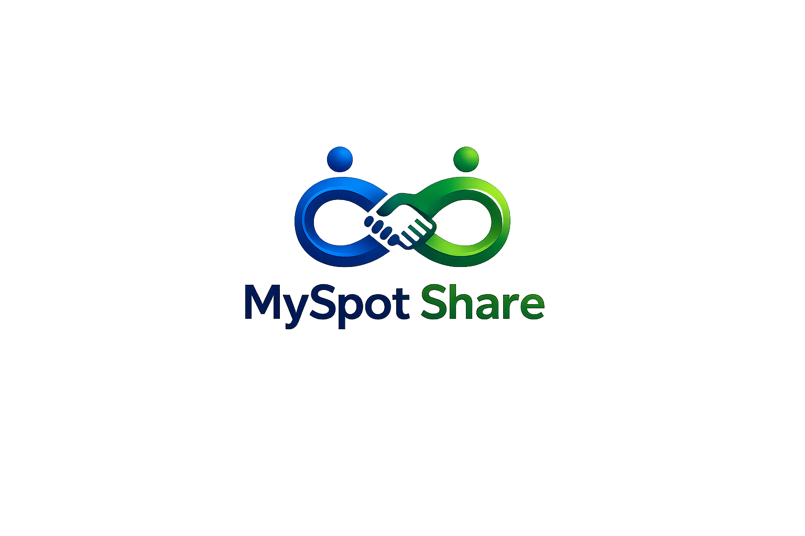

# MySpot Share — Brand & Color Guide

> **Where entrepreneurs connect and grow.**
> Blue · Green · Coral — *modern, energetic, engaging.*

This is the canonical brand reference for MySpot Share: the logo, the color
system, accessibility rules, and ready-to-paste Flutter tokens. All hex values
below were sampled directly from the supplied logo and palette board.

---

## 1. Logo



**Concept.** Two figures lean in to form a handshake whose looping arms trace an
**infinity** symbol — *people + partnership + endless growth.* The left figure
and the word **My‑Spot** are blue (trust, professionalism); the right figure and
**Share** are green (growth, opportunity, money). It reads as connection and
momentum in one mark — exactly the platform's promise.

**Anatomy**
- **Symbol** — the blue→green handshake/infinity loop. Works alone as an app
  icon and avatar.
- **Wordmark** — "MySpot" (blue) + "Share" (green), set in a rounded,
  geometric sans.

**Clear space & sizing**
- Keep clear space around the logo equal to the height of the **"o" in "Spot."**
- Minimum legible sizes: full lockup ≥ **120 px** wide; symbol-only ≥ **24 px**.
- App icon / favicon / avatar → use the **symbol only** (drop the wordmark).

**Usage**
| ✅ Do | ❌ Don't |
|------|---------|
| Use on white or very light surfaces | Place the color logo on busy photos |
| Use the symbol-only mark for the app icon | Recolor, skew, rotate, or add shadows |
| Use a solid white version on dark/blue fills | Re-typeset the wordmark in another font |
| Preserve the blue→green orientation | Swap blue/green sides or alter the gradient |

**Variants to produce** (recommended deliverables): full-color, solid white
(knockout), solid navy (`#121F34`), and a 1‑color version for stamps/embossing.
An **SVG** master is strongly recommended so the mark stays crisp at every size.

---

## 2. Color system

### 2.1 Core palette (sampled from your board)

| Token | Hex | RGB | Role |
|-------|-----|-----|------|
| **Primary Blue** | `#0052B4` | 0, 82, 180 | Primary brand, links, primary buttons, navigation |
| **Success Green** | `#329B32` | 50, 155, 50 | Growth/success, secondary brand, fills, badges |
| **Coral Accent** | `#FA4B4B` | 250, 75, 75 | Energy accent — highlights, notifications, hot CTAs |
| **Ink / Navy** | `#121F34` | 18, 31, 52 | Primary text, dark surfaces |
| **Cloud** | `#F3F6F9` | 243, 246, 249 | App background / cards on light mode |
| **White** | `#FFFFFF` | 255, 255, 255 | Surfaces, knockout logo |

**Logo gradient endpoints** (the vivid tips of the mark), useful for hero
gradients and splash screens:
`Azure #0091FF` → `Lime #A3FF2A`.

### 2.2 Tint & shade ramps

Generated from each core color (50 = lightest tint, 500 = base, 900 = darkest
shade). Use **50–100** for backgrounds/chips, **500** for fills, **600–800** for
text and pressed states.

**Blue**
`50 #E6EEF8` · `100 #CCDCF0` · `200 #99BAE1` · `300 #6697D2` · `400 #3375C3` ·
**`500 #0052B4`** · `600 #03499F` · `700 #05418A` · `800 #083875` · `900 #0A2F5F`

**Green**
`50 #EAF5EA` · `100 #D6EBD6` · `200 #ADD7AD` · `300 #84C384` · `400 #5BAF5B` ·
**`500 #329B32`** · `600 #2D8730` · `700 #28742F` · `800 #23602D` · `900 #1E4C2B`

**Coral**
`50 #FEEDED` · `100 #FEDBDB` · `200 #FDB7B7` · `300 #FC9393` · `400 #FB6F6F` ·
**`500 #FA4B4B`** · `600 #D74346` · `700 #B43C40` · `800 #91343B` · `900 #6E2C35`

### 2.3 Gradients (from the board)

| Name | Stops | Use |
|------|-------|-----|
| **Brand** (primary) | `#0052B4` → `#329B32` | Hero banners, splash, premium cards |
| **Energy** | `#0052B4` → `#FA4B4B` | Promotions, live/now highlights |
| **Logo glow** | `#0091FF` → `#A3FF2A` | Splash mark, loading states |
| **Deep** | `#121F34` → `#0052B4` | Dark headers, section dividers |

### 2.4 Semantic roles

| Meaning | Color | Notes |
|---------|-------|-------|
| Primary action | Blue `#0052B4` | White label passes contrast (7.3:1) |
| Success / growth | Green **`#1E7A2E`** | Use the darker green for text/buttons (see §3) |
| Accent / attention | Coral `#FA4B4B` | Fills & badges; darken to `#C92F2F` for text |
| **Error / destructive** | `#C62828` | Keep separate from Coral so "delete" ≠ "accent" |
| Warning | `#F4A006` | Optional amber for caution states |
| Info | Blue `#0052B4` | Reuse primary |

---

## 3. Accessibility — *the honest read on these colors*

Contrast measured against **white** using the WCAG 2.1 formula. AA needs
**4.5:1** for body text, **3:1** for large text and UI components.

| Color on white | Ratio | Body text | Large text / UI | Verdict |
|----------------|------:|:---------:|:---------------:|---------|
| Blue `#0052B4` | **7.33:1** | ✅ | ✅ | Excellent — the workhorse |
| Navy `#121F34` | **16.5:1** | ✅ | ✅ | Perfect for text |
| Green `#329B32` | 3.58:1 | ❌ | ✅ | Fills/icons/large only |
| Coral `#FA4B4B` | 3.40:1 | ❌ | ✅ | Fills/badges only |
| Green **`#1E7A2E`** | 5.41:1 | ✅ | ✅ | Use this for green *text* |
| Coral **`#C92F2F`** | 5.34:1 | ✅ | ✅ | Use this for coral *text* |

**Verdict:** this is a strong, well-matched palette — but two practical caveats:

1. **Blue is the only core color safe for small text on white.** Green `#329B32`
   and Coral `#FA4B4B` are *fill colors*: great for buttons, badges, icons,
   charts, and large headings — but they fail AA for body text and for white
   button labels. For green/coral **text or button labels, drop to the darker
   ramp** (`Green‑700 #28742F`/`#1E7A2E`, `Coral‑700 #B43C40`/`#C92F2F`).
2. **Coral sits right next to "error red."** Reserve a distinct error red
   (`#C62828`) so destructive actions never get confused with the accent. If you
   want the accent to feel unmistakably *energetic* rather than *dangerous*,
   nudging Coral slightly warmer (≈`#FF6B4D`) is an easy, on-brand option.

Everything else is genuinely good: blue + green is a natural, optimistic
"professional growth" pairing that matches the logo 1:1, and coral adds the warm
spark the two cool hues need. It will read modern and trustworthy.

---

## 4. Light & dark mode

**Light (default)**
- Background `#F3F6F9` · Surface/cards `#FFFFFF` · Text `#121F34`
- Primary `#0052B4` · Secondary `#329B32` · Accent `#FA4B4B`

**Dark**
- Background `#0E1726` · Surface `#121F34` · Elevated `#1B2A45` · Text `#E6ECF5`
- Lighten brand hues for contrast on dark: Primary `#3375C3` (Blue‑400),
  Secondary `#84C384` (Green‑300), Accent `#FC9393` (Coral‑300).
- The vivid logo tips (`#0091FF`, `#A3FF2A`) pop nicely on dark for highlights.

---

## 5. Flutter tokens (ready to use)

The app currently seeds its theme from an unrelated indigo (`#3D5AFE` in
`app/lib/core/theme/app_theme.dart`). Drop in these brand colors to align it.

```dart
// app/lib/core/theme/brand_colors.dart
import 'package:flutter/material.dart';

abstract final class Brand {
  static const blue   = Color(0xFF0052B4); // primary
  static const green  = Color(0xFF329B32); // secondary / success (fills)
  static const coral  = Color(0xFFFA4B4B); // accent (fills)
  static const ink    = Color(0xFF121F34); // text / dark surface
  static const cloud  = Color(0xFFF3F6F9); // light background

  // Accessible text variants on white (use for small text / button labels)
  static const greenText = Color(0xFF1E7A2E);
  static const coralText  = Color(0xFFC92F2F);
  static const error      = Color(0xFFC62828); // distinct from coral

  // Logo gradient
  static const azure = Color(0xFF0091FF);
  static const lime  = Color(0xFFA3FF2A);
  static const brandGradient = LinearGradient(colors: [blue, green]);
}
```

```dart
// Light ColorScheme override (Material 3)
final lightScheme = ColorScheme.fromSeed(
  seedColor: Brand.blue,
  brightness: Brightness.light,
).copyWith(
  primary:   Brand.blue,
  secondary: Brand.green,
  tertiary:  Brand.coral,
  error:     Brand.error,
  surface:   Colors.white,
  onSurface: Brand.ink,
);
```

> Tip: keep `ColorScheme.fromSeed` so Material generates accessible container/
> on‑* pairs automatically, then override only `primary/secondary/tertiary/error`
> as above. For green/coral **text**, reference `Brand.greenText` / `Brand.coralText`
> directly rather than the fill tokens.

---

## 6. Typography (pairing suggestion)

The wordmark is a rounded geometric sans. For product UI, pair with a clean,
highly legible sans that has a friendly-but-professional tone:

- **Headlines / display:** *Poppins* or *Plus Jakarta Sans* (echoes the rounded logo)
- **Body / UI:** *Inter* (superb legibility at small sizes)
- Set body text in **Ink `#121F34`**, secondary text at ~70% opacity.

---

*Assets in this folder:* `myspot-share-logo.png` (master logo),
`palette-reference.png` (your source palette board).
